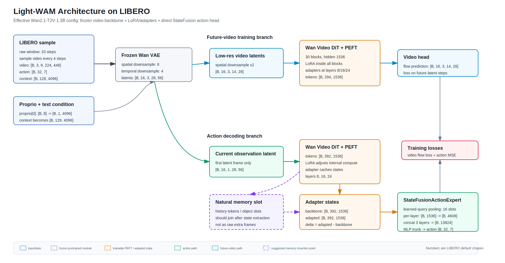

# Light-WAM architecture and tensor shapes

这份笔记按当前仓库默认 `task=libero_uncond_2cam224_1e-4`、`model=lightwam` 拆解。注意：`configs/model/lightwam.yaml` 里写着一套 3072/48 的 video DiT 配置，但运行时 `video_backbone_type: wan2_1_t2v` 会通过 preset 覆盖为 Wan2.1-T2V-1.3B 的有效配置。

## 0. Architecture diagram



## 1. Effective config

### Data side

LIBERO 默认训练样本：

```text
raw cameras:
  image       [3, 512, 512]
  wrist_image [3, 512, 512]

after transform:
  each camera [3, 224, 224]

after horizontal concat:
  video frame [3, 224, 448]

sequence:
  raw_window_steps = 33
  action_video_freq_ratio = 4
  video_model_frames = 9   # indices 0,4,8,...,32
  action_horizon = 32      # raw_window_steps - 1

model inputs after collation:
  video     [B, 3, 9, 224, 448]
  action    [B, 32, 7]
  proprio   [B, 32, 8]
  context   [B, 128, 4096]   # precomputed text embedding
```

The model uses `proprio[:, 0, :]`, projects it to text dimension, and appends it as one extra context token:

```text
proprio token: [B, 8] -> Linear(8, 4096) -> [B, 1, 4096]
context:       [B, 128, 4096] -> [B, 129, 4096]
```

### Effective Wan2.1 video DiT config

The actual Wan2.1 preset overrides the YAML video DiT values:

```text
video backbone type: wan2_1_t2v
VAE latent channels: 16
VAE spatial downsample: 8
VAE temporal downsample: 4

video DiT:
  in_dim        = 16
  out_dim       = 16
  hidden_dim    = 1536
  ffn_dim       = 8960
  num_layers    = 30
  num_heads     = 12
  attn_head_dim = 128
  patch_size    = [1, 2, 2]
  text_dim      = 4096
  freq_dim      = 256
```

### Light-WAM adaptation config

```text
WAM adapters:
  enabled layers: [8, 16, 24]
  adapter dim: 256
  each adapter: 1536 -> 256 -> 1536 residual MLP

LoRA:
  enabled layers: [0..29]
  rank: 64
  alpha: 128
  targets:
    self_attn.q/k/v/o
    cross_attn.q/k/v/o
    ffn.0 / ffn.2

StateFusionActionExpert:
  feature_sources: [adapted]
  fusion layers: 3
  token pooling: learned_query
  num queries: 16
  pooling heads: 8
  per_layer_dim: 4608
  trunk_dim: 6144
  num_trunk_blocks: 1
  step_pos_dim: 256
```

## 2. High-level graph

Light-WAM state-fusion training has two video-backbone uses:

```text
video frames
  -> VAE encode
  -> future-video branch
       full video latents, low spatial resolution
       predicts future/video flow target

  -> action branch
       first-frame latents, high spatial resolution
       runs video backbone once
       caches adapter states
       StateFusionActionExpert predicts action chunk directly
```

The important action path is:

```text
first frame latent
  -> Wan video DiT blocks
  -> adapter states at layers 8/16/24
  -> learned-query pooling
  -> per-layer compressors
  -> fused MLP trunk
  -> action step positional tokens
  -> output MLP
  -> action [B, 32, 7]
```

## 3. VAE and video tokens

Input video:

```text
video [B, 3, 9, 224, 448]
```

Wan2.1 VAE:

```text
T_lat = (9 - 1) / 4 + 1 = 3
H_lat = 224 / 8 = 28
W_lat = 448 / 8 = 56

input_latents [B, 16, 3, 28, 56]
```

### Future-video branch

`video_latent_spatial_downsample_factor = 2`, so future-video training uses low-res latent grids:

```text
video_supervision_latents_model [B, 16, 3, 14, 28]
latents_video                  [B, 16, 3, 14, 28]
target_video                   [B, 16, 3, 14, 28]
```

Video DiT patch embedding uses `Conv3d(16 -> 1536, kernel=[1,2,2], stride=[1,2,2])`:

```text
before patch: [B, 16, 3, 14, 28]
after patch:  [B, 1536, 3, 7, 14]
tokens:       [B, 3*7*14, 1536] = [B, 294, 1536]

tokens_per_frame = 7 * 14 = 98
```

The future branch predicts video flow:

```text
backbone output tokens [B, 294, 1536]
head output tokens     [B, 294, 16*1*2*2] = [B, 294, 64]
unpatchify             [B, 16, 3, 14, 28]
```

If the first frame is fused as condition, the loss is applied after slicing out the first latent frame:

```text
pred_video[:, :, 1:]   [B, 16, 2, 14, 28]
target_video[:, :, 1:] [B, 16, 2, 14, 28]
```

### Action branch

For action prediction, Light-WAM uses only the first latent frame and does not apply the spatial downsample by default:

```text
observation_latents [B, 16, 1, 28, 56]
```

Patch embedding:

```text
before patch: [B, 16, 1, 28, 56]
after patch:  [B, 1536, 1, 14, 28]
tokens:       [B, 1*14*28, 1536] = [B, 392, 1536]

tokens_per_frame = 14 * 28 = 392
```

These 392 tokens are the dense current-state tokens that the action head reads through adapter caches.

## 4. Text and proprio conditioning

Before entering the video DiT:

```text
context before model text embedding:
  [B, 129, 4096]

text_embedding:
  Linear(4096, 1536)
  GELU
  Linear(1536, 1536)

context inside DiT:
  [B, 129, 1536]
```

For non-action-conditioned video DiT:

```text
context_mask:
  future branch [B, 294, 129]
  action branch [B, 392, 129]
```

## 5. One video DiT block

Each of 30 DiT blocks receives:

```text
x_tokens  [B, S, 1536]
context   [B, 129, 1536]
t_mod     [B, S, 6, 1536]   # separated timestep mode
freqs     [S, 1, 128]
```

Inside each block:

```text
self-attention:
  q/k/v/o hidden width = 1536
  num_heads = 12
  head_dim = 128

cross-attention:
  query from x_tokens
  key/value from text+proprio context

FFN:
  1536 -> 8960 -> 1536
```

LoRA is added inside these projections:

```text
self_attn.q/k/v/o:
  base: Linear(1536, 1536), frozen
  LoRA: 1536 -> 64 -> 1536

cross_attn.q/k/v/o:
  base: Linear(1536, 1536), frozen
  LoRA: 1536 -> 64 -> 1536

ffn.0:
  base: Linear(1536, 8960), frozen
  LoRA: 1536 -> 64 -> 8960

ffn.2:
  base: Linear(8960, 1536), frozen
  LoRA: 8960 -> 64 -> 1536
```

## 6. Adapter states

At selected layers `[8, 16, 24]`, the block output passes through a residual adapter:

```text
backbone_tokens [B, S, 1536]
delta_tokens    = up(GELU(down(LayerNorm(backbone_tokens))))
adapted_tokens  = backbone_tokens + delta_tokens
```

Adapter dimensions:

```text
LayerNorm(1536)
Linear(1536, 256)
GELU
Linear(256, 1536)
residual add
```

The model caches:

```text
layer 8:
  backbone [B, S, 1536]
  adapted  [B, S, 1536]
  delta    [B, S, 1536]   # constructed later as adapted - backbone

layer 16: same
layer 24: same
```

For the action branch, `S = 392`.

Current config uses only:

```text
feature_sources = [adapted]
```

So StateFusionActionExpert reads:

```text
3 layers * adapted tokens [B, 392, 1536]
```

## 7. Learned-query pooling

Each selected layer/source has its own LearnedQueryPooler.

Input:

```text
tokens [B, 392, 1536]
```

Learned queries:

```text
query_tokens [16, 1536]
expanded     [B, 16, 1536]
```

MHA pooling:

```text
query = learned queries [B, 16, 1536]
key   = LayerNorm(tokens) [B, 392, 1536]
value = LayerNorm(tokens) [B, 392, 1536]

MHA heads = 8
pooled slots [B, 16, 1536]
```

Default merge:

```text
learned weighted merge over 16 query slots
[B, 16, 1536] -> [B, 1536]
output LayerNorm -> [B, 1536]
```

Interpretation:

```text
16 query slots temporarily read different useful regions/features.
They are then merged into one compact state vector per layer/source.
```

## 8. StateFusionActionExpert

For each of the three selected layers:

```text
pooled adapted feature [B, 1536]
LayerFusionCompressor:
  LayerNorm(1536)
  Linear(1536, 4608)
  GELU
  Linear(4608, 4608)

layer feature [B, 4608]
```

Fuse three layers:

```text
concat:
  [B, 4608] * 3 -> [B, 13824]

fused_norm:
  LayerNorm(13824)

fused_proj:
  Linear(13824, 6144)

state:
  [B, 6144]
```

Trunk:

```text
1 residual MLP block:
  LayerNorm(6144)
  Linear(6144, 6144)
  GELU
  Linear(6144, 6144)
  residual add

state [B, 6144]
```

Action step positional embedding:

```text
positions: 0..31
sinusoidal_embedding_1d(256, positions) -> [32, 256]

step_pos_proj:
  LayerNorm(256)
  Linear(256, 6144)
  GELU
  Linear(6144, 6144)

step tokens:
  state[:, None, :] + step_pos_proj[None, :, :]
  [B, 32, 6144]
```

Output:

```text
output_norm: LayerNorm(6144)
output MLP:
  Linear(6144, 6144)
  GELU
  Linear(6144, 7)

pred_action [B, 32, 7]
```

Training action loss:

```text
MSE(pred_action, ground_truth_action)
```

There is no separate loss for LoRA, adapters, pooling queries, or slots.

## 9. Parameter counts for trainable adaptation modules

Approximate exact counts from the effective Wan2.1 dims:

```text
WAM adapter:
  per adapter layer: 791,296 params
  3 layers total:    2,373,888 params

LoRA:
  per DiT layer: 2,916,352 params
  30 layers:     87,490,560 params

StateFusionActionExpert:
  learned-query pooler per layer/source: 9,474,064 params
  compressor per layer:                  28,323,840 params
  total action expert:                   351,028,791 params
```

So Light-WAM's trainable action reader is not tiny. The "lightweight" part mainly comes from freezing the large video backbone and avoiding a separate generative ActionDiT denoising head.

## 10. Where memory would naturally plug in

The cleanest memory insertion points are:

```text
1. before learned-query pooling:
   current adapted tokens [B, 392, 1536]
   history memory tokens  [B, M, 1536]
   pool/query over current + memory

2. after pooling:
   current layer feature [B, 1536]
   memory slots          [B, K, 1536]
   cross-attention / gated fusion

3. before action step output:
   step tokens [B, 32, 6144]
   attend to memory slots
```

For research, option 2 or 3 is often cleaner than directly appending historical image frames to the video DiT input, because it separates:

```text
current visual state extraction
memory state update/read
action decoding
```

## 11. Recommended tools

### Best practical option: custom PyTorch forward hooks

For this repo, a custom shape tracer is better than generic model visualizers because `forward()` passes dictionaries, caches adapter states, and has multiple paths.

What to hook:

```text
video_expert.patch_embedding
video_expert.blocks.{0,8,16,24,29}
video_expert.wam_adapters.{8,16,24}
state_fusion_action_expert.layer_poolers
state_fusion_action_expert.layer_compressors
state_fusion_action_expert.fused_proj
state_fusion_action_expert.output
```

Recommended output columns:

```text
module name
input shape
output shape
dtype
num params
requires_grad params
```

### Useful supporting tools

```text
torchinfo:
  Good for normal nn.Module summaries, weaker for dict-heavy/dynamic forward paths.

torch.fx:
  Good for graph capture if the forward is static; likely awkward here due dicts/caches/control flow.

PyTorch profiler:
  Best for runtime/memory hotspots, not architecture readability.

Netron:
  Good for ONNX/static exported graphs, but exporting this dynamic model may be painful.

TensorBoard graph:
  Useful if you can create a clean dummy forward path.
```

For our use case, I would build a repo-local `scripts/trace_lightwam_shapes.py` that runs synthetic latent tensors through the future branch and action branch, then dumps a Markdown/JSON shape report. That would be more reliable than trying to force Netron or torchinfo to understand the whole training step.

This repo now includes that script:

```bash
# Static config-derived report. Does not instantiate the model or load weights.
PYTHONPATH=src mamba run -n fastwam python scripts/trace_lightwam_shapes.py \
  task=libero_uncond_2cam224_1e-4 \
  +trace.mode=static \
  +trace.output_dir=./architecture_traces

# Real forward-hook report with random weights. Does not load Wan checkpoints,
# but it does instantiate the full model, so prefer a GPU.
PYTHONPATH=src mamba run -n fastwam python scripts/trace_lightwam_shapes.py \
  task=libero_uncond_2cam224_1e-4 \
  +trace.mode=hooks \
  +trace.device=cuda:0 \
  +trace.dtype=bf16 \
  +trace.branch=action \
  +trace.output_dir=./architecture_traces_hooks
```

The generated files are:

```text
architecture_traces/lightwam_shape_trace.json
architecture_traces/lightwam_shape_trace.md
```
